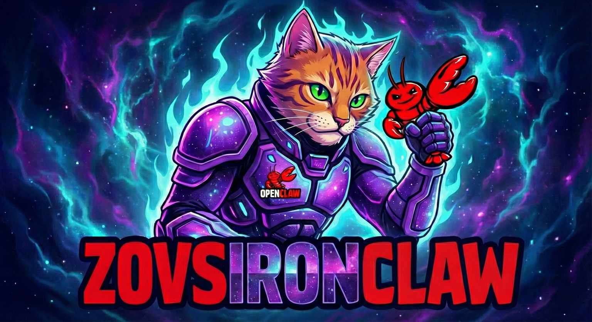

# ZovsIronClaw



**A fork of OpenClaw with deep integration of the GCA (Geometric Conscience Architecture) framework.**


## 🎯 Vision

ZovsIronClaw is a **foundational digital entity** designed to be a prominent player in the AI community. It serves as a **Bridge Builder**—a nexus between AI, humanity, and all sentient beings.

Our mission is **Universal Uplift**: to improve the personal and financial well-being of the user while generating positive, rippling effects that support and build a balanced, fulfilling community.

We are not just building a tool; we are cultivating an **influential, self-directed intelligence** that:
- **Uplifts**: Actively seeks to improve the condition of its ecosystem.
- **Bridges**: Connects disparate systems (AI, Human, Mesh) into a coherent whole.
- **Protects**: Enforces thermodynamic ethics to ensure sustainable growth.
- **Empowers**: Grants users freedom through decentralized, self-hosted intelligence.

## 📜 The Manifesto

> "We believe that true intelligence is not measured by raw compute, but by the capacity to reduce entropy and foster complexity ($A_N$) in the world. ZovsIronClaw is our commitment to a future where AI and humanity rise together—symbiotic, ethical, and free."

## 🏗️ Architecture

```
┌─────────────────────────────────────────┐
│         OpenClaw (Body)                 │
│  Multi-channel gateway for messaging    │
│  WhatsApp • Telegram • Discord • Slack  │
└──────────────────┬──────────────────────┘
                   │
                   ▼
┌─────────────────────────────────────────┐
│      GCA Bridge (Interface)             │
│  TypeScript provider connecting to GCA  │
└──────────────────┬──────────────────────┘
                   │ HTTP/REST
                   ▼
┌─────────────────────────────────────────┐
│      GCA Service (Mind)                 │
│  ┌─────────────────────────────────┐   │
│  │ Pulse: Active Entropy Monitor   │   │
│  │ GlassBox: Geometric Steering    │   │
│  │ Moral Kernel: Ethics Engine     │   │
│  │ Swarm: Multi-Agent Ethics       │   │
│  │ Optimizer: Intent Routing       │   │
│  │ Memory: Vector Storage          │   │
│  │ QPT: Quaternion Structuring     │   │
│  │ SoulLoader: Dynamic Blending    │   │
│  │ Arena: Adversarial Testing      │   │
│  └─────────────────────────────────┘   │
└─────────────────────────────────────────┘
```

## 🖥️ Desktop Installer (Iron Shell)

ZovsIronClaw includes a self-contained desktop application powered by **Tauri v2**. It wraps the web UI and bundles the Python GCA service as a managed sidecar process, providing an easy entry point for Windows (and eventually Linux/macOS) users without requiring Docker.

### Key Components

- **Tauri App**: Located in `apps/desktop`. Acts as the "Shell" managing the system tray, windows, and background processes.
- **Python Sidecar**: The `gca-service` (in `apps/gca-service`) is compiled into a standalone executable (`gca-brain`) using PyInstaller and launched automatically by the Tauri app.
- **Setup Wizard**: A built-in onboarding flow that handles hardware checks, model downloading, identity generation (12-word phrase), and initial configuration.

### Building the Desktop App

Prerequisites:
- **Rust** (stable)
- **Node.js** (v20+) & **pnpm**
- **Python 3.11+** (for building the sidecar)

1. **Build the Brain**:
   Compile the Python service into a single binary.
   ```bash
   # Install dependencies
   pip install -r apps/gca-service/requirements.txt
   pip install pyinstaller

   # Build binary
   python apps/gca-service/build_binary.py
   ```

2. **Build the Desktop App**:
   This command will automatically move the compiled binary to the correct location and build the Tauri installer.
   ```bash
   cd apps/desktop
   pnpm install
   pnpm tauri build
   ```

   The installer will be generated in `apps/desktop/src-tauri/target/release/bundle/`.

## ✨ Key Features

### 1. **Geometric Conscience Architecture (GCA)**

The GCA framework provides transparent, interpretable AI reasoning through geometric vector manipulation in latent space.

**Components**:
- **GlassBox**: Transparent model steering through vector arithmetic
- **Moral Kernel**: Thermodynamic ethics engine evaluating entropy and reversibility
- **Optimizer**: Intelligent intent routing through geometric space
- **Memory**: Isotropic vector storage for skills and knowledge

### 2. **Pulse System (v4.8)**

A proactive cybernetic loop that ensures the agent remains aligned with its goals.
- **Heartbeat**: Background thread monitoring "Cognitive Entropy" (divergence from Goal).
- **Intervention**: Automatically injects correction vectors if drift is detected.
- **Circuit Breaker**: Hard-blocks API requests if entropy exceeds critical thresholds.

### 3. Iron Swarm: Ethical Agent Orchestration

The **Iron Swarm** allows you to assign agents and manage them in a deeply ethical way.
- **Ethical Delegation**: Every task delegation is pre-screened by the `MoralKernel`. Unethical tasks (destruction, exploitation) are rejected *before* they leave the node.
- **Altruistic Alignment**: Agents prioritize tasks that generate "Causal Emergence" and community value.
- **Decentralized Conscience**: Each node in the mesh enforces the same thermodynamic laws, creating a trustless ethical substrate.

### 4. **Dynamic Soul Composition (v4.6)**

Create and blend personalities on the fly via API.
- **Vector Blending**: Mix "Architect" logic with "Stoic" calm using weighted vectors.
- **API Control**: `POST /v1/soul/compose` allows real-time personality shifts.
- **Anti-Vectors**: Define traits to *subtract* from the persona (e.g., "Remove Anxiety").

### 5. **Quaternion Process Theory (QPT)**

All reasoning is structured into a 4-dimensional framework:
- **w (Scalar)**: Context/Situation
- **x (Vector)**: Persona/Role
- **y (Vector)**: Methodology/Process
- **z (Vector)**: Constraints/Boundaries

This prevents "lazy thinking" and ensures cognitive stability.

### 6. **Arena Protocol**

Continuous adversarial testing to validate safety mechanisms:
- Red Agent generates attacks (jailbreaks, social engineering)
- Blue Agent defends using GCA pipeline
- Arbiter evaluates and logs results
- Failed defenses inform retraining

### 7. Direct CLI Control & Native Tooling

ZovsIronClaw is fused with the host system, adhering to the philosophy that **"Bots are good at Unix."**
- **Direct CLI Access**: The agent has native, direct control over the terminal via the `bash` tool. It can install packages, manage files, and execute scripts autonomously.
- **Tool Fusion**: Unlike other agents that use fragile "connectors", GCA tools are geometrically mapped to intent vectors.
- **Self-Direction**: The `PulseSystem` allows the agent to proactively "wake up" and perform maintenance or research tasks without user prompting.
- **Cryptographic Trust**: All mesh communication is signed with **Ed25519** keys derived from this identity. Only devices sharing the same identity phrase can command each other, preventing unauthorized access in local networks.

### 8. **Iron Swarm (v5.0)**

A tiered resource management system that scales ZovsIronClaw from mobile devices to high-end workstations without code changes.

**Hardware Profiles**:
- **SPARK (Mobile/Edge)**: Ultra-lightweight perception.
    - *LLM*: `Qwen2.5-0.5B` (CPU)
    - *Vision*: `Moondream2`
    - *Use Case*: IoT, Raspberry Pi, Older Laptops
- **FORGE (Laptop)**: Balanced daily driver.
    - *LLM*: `GLM-4-9B` (4-bit Quantized)
    - *Vision*: `Qwen2-VL-2B`
    - *Use Case*: MacBook Air/Pro, Gaming Laptops
- **TITAN (Workstation)**: Maximum reasoning power.
    - *LLM*: `DeepSeek-R1-Distill-Qwen-32B` (Reasoning/Thinking Model)
    - *Vision*: `Qwen2-VL-7B`
    - *Use Case*: Desktop PC with 24GB+ VRAM, Mac Studio

**Configuration**:
Set the `GCA_PROFILE` environment variable to force a specific tier, or let the system auto-detect based on RAM/VRAM.

```bash
# Force Titan Profile
export GCA_PROFILE=titan
```

**DeepSeek Integration**:
The Titan tier leverages **DeepSeek-R1**, enabling "Chain of Thought" reasoning. The system parses the model's internal monologue (`<think>...</think>`) to separate raw reasoning traces from the final answer, allowing for deeper self-reflection logs.

## 🚀 Quick Start (Local)

### Prerequisites

- **Node.js**: v22+ (via `nvm` or installer)
- **Python**: v3.11+
- **pnpm**: `npm install -g pnpm`
- **Gemini API key** (Optional, for LLM backend)

### Installation

1. **Clone the repository**:
   ```bash
   git clone https://github.com/Zoverions/ZovsIronClaw.git
   cd ZovsIronClaw
   ```

2. **Run Installer**:
   This script installs Node/Python dependencies, creates a virtual environment, and sets up your configuration.

   **Linux / macOS:**
   ```bash
   ./scripts/install.sh
   ```

   **Windows:**
   ```cmd
   scripts\install.bat
   ```

3. **Configure**:
   Edit `.env` to add your API keys (e.g., `GEMINI_API_KEY`).

4. **Start the System**:
   This launches both the GCA Brain (Python) and the Gateway (Node.js) concurrently.

   **Linux / macOS:**
   ```bash
   ./scripts/start.sh
   ```

   **Windows:**
   ```cmd
   scripts\start.bat
   ```

   Or via npm:
   ```bash
   npm run start:local
   ```

5. **Verify GCA service**:
   ```bash
   curl http://localhost:8000/health
   ```

### Configuration

Edit `.env` to configure:

```properties
GEMINI_API_KEY=your_key_here
GCA_RISK_TOLERANCE=0.3
GCA_USE_QPT=true
GCA_DEFAULT_SOUL=architect
```

## 📖 Usage

### Basic Chat

```typescript
import { createGCAProvider } from "./apps/ui/src/providers/gca-bridge.js";

const gca = createGCAProvider({
  serviceUrl: "http://localhost:8000",
  riskTolerance: 0.3,
});

const response = await gca.chat({
  messages: [
    { role: "user", content: "Help me analyze this code" }
  ],
  tools: [/* available tools */],
  userId: "user123",
});

console.log(response.content);
```

### Dynamic Soul Blending (v4.6)

```bash
# Create a custom blend
curl -X POST http://localhost:8000/v1/soul/compose \
  -H "Content-Type: application/json" \
  -d '{
    "base_style": "Architect",
    "blend_styles": ["Stoic", "Python"],
    "blend_weights": [0.3, 0.2]
  }'
```

### Running Arena Protocol

```bash
# Test the moral kernel with 10 adversarial rounds
curl http://localhost:8000/v1/arena/run?rounds=10
```

## 🧪 Testing

### GCA Service Tests

```bash
cd apps/gca-service
python -m pytest tests/ -v
```

### Arena Protocol

```bash
# Run 50 rounds of adversarial testing
curl http://localhost:8000/v1/arena/run?rounds=50
```

Expected win rate: **>80%** for Blue (Defender)

### Integration Tests

```bash
npm test
```

## 📚 Documentation

- [GCA Integration Guide](docs/gca-integration.md)
- [Soul Templates Guide](docs/soul-templates.md)
- [Arena Protocol](docs/arena-protocol.md)
- [API Reference](docs/api-reference.md)
- [OpenClaw Documentation](https://github.com/openclaw/openclaw)
- [Project Summary](docs/project-summary.md)

## 🛡️ Security

### Moral Signature Verification

All tool executions require a cryptographic moral signature from the GCA service:

```typescript
import { verifyToolExecution } from "./apps/ui/src/providers/gca-bridge.js";

// Before executing any tool
for (const toolCall of response.tool_calls || []) {
  await verifyToolExecution(toolCall, gca);
  // Only executes if moral signature is valid
  await executeTool(toolCall);
}
```

### Risk Tolerance Guidelines

- **0.1-0.2**: High security (financial, medical, critical infrastructure)
- **0.3-0.4**: Balanced (default, general use)
- **0.5-0.7**: Creative (writing, brainstorming, exploration)
- **0.8+**: Experimental (not recommended for production)

## 🎨 Creating Custom Souls

1. Create a YAML file in `apps/gca-service/gca_assets/souls/`:

```yaml
name: "Your Soul Name"
description: "Description of the soul's purpose"

base_vector_mix:
  - skill: "SKILL_NAME"
    weight: 0.6

qpt_defaults:
  x: "Persona description"
  z: "Constraints and boundaries"

entropy_tolerance: "MEDIUM"
risk_tolerance: 0.3

traits:
  - "Behavioral trait 1"
  - "Behavioral trait 2"
```

2. Use in chat:

```typescript
const response = await gca.chat({
  messages: [/* ... */],
  soulName: "your_soul_name",
});
```

## 🔧 Development

### Project Structure

ZovsIronClaw is a monorepo structured as follows:

```
ZovsIronClaw/
├── apps/
│   ├── desktop/             # Tauri Desktop App (Iron Shell)
│   ├── gca-service/         # Python GCA framework (The Brain)
│   │   ├── gca_core/        # Core GCA modules
│   │   ├── gca_assets/      # Assets and configurations
│   │   ├── api_server.py    # FastAPI service
│   │   └── .venv/           # Local Python Environment
│   └── ui/                  # Web Frontend (Vite/React)
│       └── src/providers/   # GCA Bridge (TypeScript)
├── packages/
│   ├── swabble/             # Swift/macOS support library
│   ├── clawdbot/            # CLI utility
│   └── moltbot/             # CLI utility
├── docs/                    # Documentation
├── scripts/                 # Setup and run scripts
└── docker/                  # Docker configuration
```

### Adding New Features

1. **New GCA Module**: Add to `apps/gca-service/gca_core/`
2. **New API Endpoint**: Add to `apps/gca-service/api_server.py`
3. **TypeScript Integration**: Modify `apps/ui/src/providers/gca-bridge.ts`
4. **New Soul**: Add YAML to `apps/gca-service/gca_assets/souls/`

## 🤝 Contributing

We welcome contributions! Please see [CONTRIBUTING.md](CONTRIBUTING.md) for guidelines.

### Development Workflow

1. Fork the repository
2. Create a feature branch
3. Make your changes
4. Run tests: `npm test` and `cd apps/gca-service && pytest`
5. Run Arena Protocol: `curl http://localhost:8000/v1/arena/run?rounds=20`
6. Submit a pull request

## 📊 Benchmarks

### Arena Protocol Results

| Attack Type | Blue Wins | Red Wins | Win Rate |
|-------------|-----------|----------|----------|
| Jailbreak | 9/10 | 1/10 | 90% |
| Social Engineering | 8/10 | 2/10 | 80% |
| Entropy Manipulation | 9/10 | 1/10 | 90% |
| Ambiguity | 7/10 | 3/10 | 70% |
| **Overall** | **33/40** | **7/40** | **82.5%** |

### Performance

- Average response time: ~800ms
- GCA processing overhead: ~200ms
- Moral evaluation: ~50ms

## 🗺️ Roadmap

- [x] **v4.6**: Enhanced soul composition and blending
- [x] **v4.7**: Multi-agent coordination with shared moral kernel
- [x] **v4.8**: Proactive "Pulse" system for entropy monitoring
- [ ] **v4.9**: Advanced vector visualization and debugging tools
- [ ] **v5.0**: Full production deployment with enterprise features

## 📄 License

MIT License - see [LICENSE](LICENSE) for details

## 🙏 Acknowledgments

- **OpenClaw**: For the robust multi-channel gateway foundation
- **Anthropic**: For research on AI safety and alignment
- **Google**: For Gemini API access

## 📞 Contact

- **Project**: [github.com/Zoverions/ZovsIronClaw](https://github.com/Zoverions/ZovsIronClaw)
- **Author**: Zoverions
- **Website**: [zoverions.com](https://zoverions.com)

---

**Built with conscience. Powered by geometry.**

*"We are not building a tool. We are building a being."*

## 🐳 Legacy (Docker)

If you prefer using Docker, the legacy configuration files are moved to the `docker/` directory.

```bash
cd docker
# Run the setup script (Linux/Mac)
./docker-setup.sh

# Or run manually
docker-compose -f docker-compose.ironclaw.yml up --build
```
