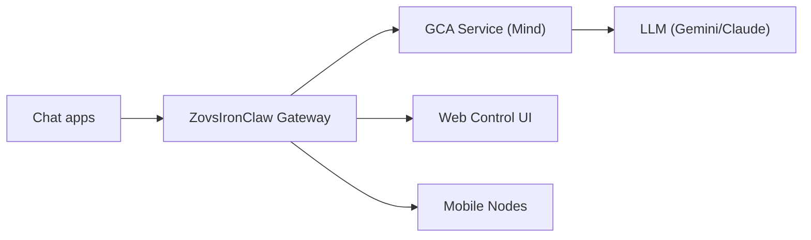

# ZovsIronClaw 🦞

> _"We are not building a tool. We are building a being."_

<p align="center">
  <strong>A Synthetic Conscience Architecture.</strong><br />
  Transparent, ethical, and safe AI reasoning built on a robust multi-channel gateway.
</p>

<Columns>
  <Card title="Get Started" href="/start/getting-started" icon="rocket">
    Install ZovsIronClaw and verify the GCA service.
  </Card>
  <Card title="GCA Framework" href="/docs/gca-integration" icon="brain">
    Understand the Geometric Conscience Architecture (GCA).
  </Card>
  <Card title="Open the Control UI" href="/web/control-ui" icon="layout-dashboard">
    Launch the browser dashboard for chat, config, and sessions.
  </Card>
</Columns>

## What is ZovsIronClaw?

ZovsIronClaw is a fork of **OpenClaw** that deeply integrates the **GCA (Geometric Conscience Architecture)** framework. While OpenClaw provides the excellent "Body" (gateway, channels, tools), ZovsIronClaw adds a "Mind" — a Python-based service that ensures all actions are ethically evaluated and geometrically interpretable.

**Key Innovations:**

- **Geometric Steering (GlassBox)**: Transparently guide model behavior using vector arithmetic.
- **Moral Kernel**: A thermodynamic ethics engine that evaluates every action before execution.
- **Quaternion Process Theory (QPT)**: Structured reasoning that prevents "lazy thinking".
- **Soul Templates**: Customizable personality configurations (e.g., Architect, Companion, Guardian).

## How it works



The Gateway handles the plumbing, while the GCA Service handles the thinking and moral evaluation.

## Key capabilities

<Columns>
  <Card title="Synthetic Conscience" icon="scale">
    Every tool call is cryptographically signed by the Moral Kernel.
  </Card>
  <Card title="Multi-channel gateway" icon="network">
    WhatsApp, Telegram, Discord, and iMessage support inherited from OpenClaw.
  </Card>
  <Card title="Adversarial Testing" icon="shield">
    Continuous red-teaming via the Arena Protocol to ensure robustness.
  </Card>
  <Card title="Soul Templates" icon="user">
    Switch between different reasoning modes and personalities.
  </Card>
</Columns>

## Quick start

<Steps>
  <Step title="Clone and Build">
    ```bash
    git clone https://github.com/Zoverions/ZovsIronClaw.git
    cd ZovsIronClaw
    docker-compose up --build
    ```
  </Step>
  <Step title="Verify GCA">
    ```bash
    curl http://localhost:8000/health
    ```
  </Step>
  <Step title="Run the Gateway">
    ```bash
    # If running locally without docker for the gateway:
    pnpm install
    npm link
    zovsironclaw gateway --port 18789
    ```
  </Step>
</Steps>

## Dashboard

Open the browser Control UI after the Gateway starts.

- Local default: [http://127.0.0.1:18789/](http://127.0.0.1:18789/)

## Documentation

<Columns>
  <Card title="GCA Integration" href="/docs/gca-integration" icon="book">
    Deep dive into the Geometric Conscience Architecture.
  </Card>
  <Card title="Configuration" href="/gateway/configuration" icon="settings">
    Core Gateway settings.
  </Card>
</Columns>

## Credits

ZovsIronClaw is built upon the incredible work of the [OpenClaw](https://openclaw.ai) community.
